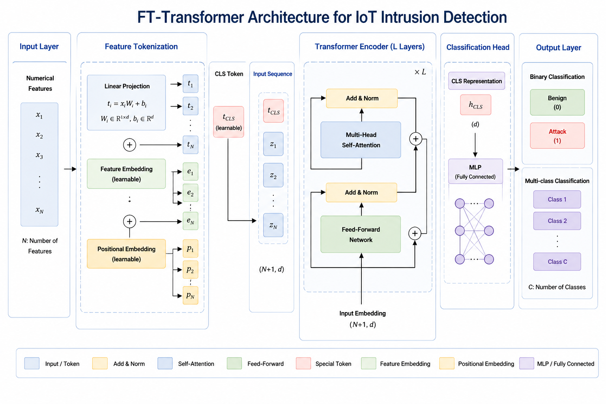
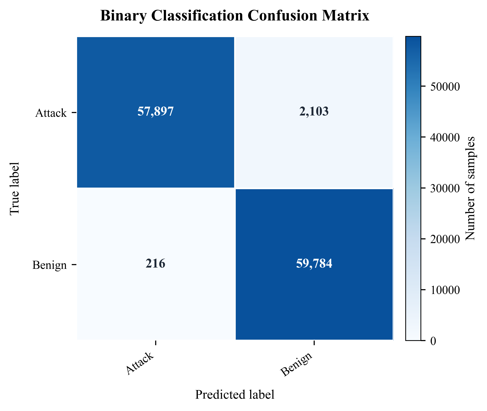
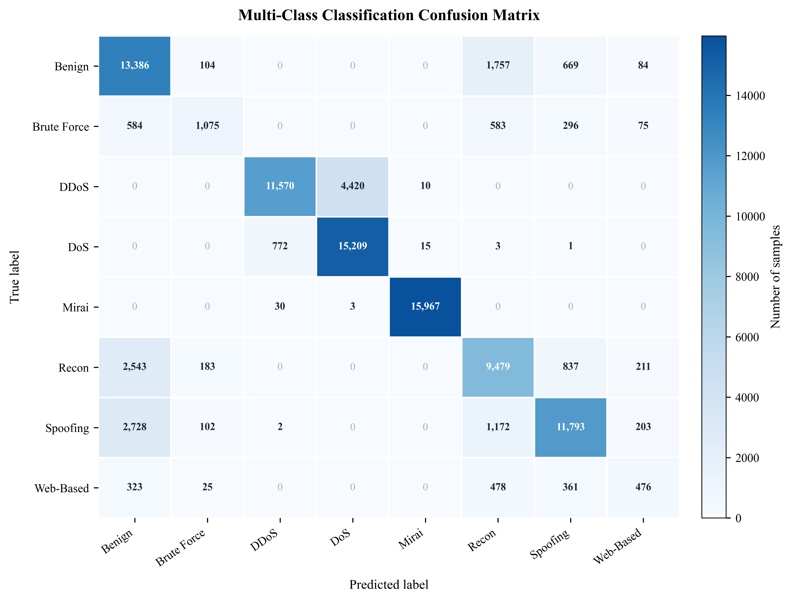

<a id="中文说明"></a>

# 基于 FT-Transformer 的物联网网络攻击检测与跨数据集泛化分析

**中文** | [English](#english)

本文对应论文的代码与历史实验产物：

> Fapeng Li, Yatong Tao, and Leilei Qu. “FT-Transformer-Based IoT Network Attack Detection and Cross-Dataset Generalization Analysis.” *Electronics* 15, no. 12 (2026): 2516. [https://doi.org/10.3390/electronics15122516](https://doi.org/10.3390/electronics15122516)

本项目研究 FT-Transformer 能否识别物联网网络中的恶意流量、区分不同攻击族，并分析模型在特征分布不同的数据集之间是否仍具有有效的泛化能力。仓库包含数据预处理、训练、评估、基线、可解释性和论文修订验证代码，以及经过筛选的小型机器可读实验结果。仓库不发布原始数据集和模型权重。

## 任务与数据集

- CICIoT2023 二分类：Attack 与 Benign。
- CICIoT2023 多分类：**7 个攻击族加 Benign，共 8 个类别**。
- 使用 38 个共享特征开展 CICIoT2023 到 CICIoMT2024 的对齐特征评估。
- 在论文修订实验中开展 NF-ToN-IoT 到 NF-BoT-IoT 的外部验证。
- 保留历史 CORAL 域对齐实验，同时明确记录其限制。

数据集来源和本地目录结构见 [docs/DATASETS.md](docs/DATASETS.md)。

## 模型

### 论文贡献与模型定位

本研究没有提出原始 FT-Transformer 架构。论文的主要贡献是围绕 IoT 表格流量检测进行系统实验：在主数据集上完成二分类和 8 类分类，设计 38 维共享特征、92 维特征并集和 10 维 NetFlow 三种外部验证协议，引入传统与现代强基线、McNemar 成对检验和全局/局部 SHAP，并初步探索 CORAL 域对齐。实验同时保留负面结果：树模型在主数据集上略强，FT-Transformer 在 92 维特征并集外部测试中的 ROC-AUC 明显下降。因此，本文贡献应理解为**系统的模型评估、跨数据集协议和证据边界分析**，而不是新的 Transformer 基础结构或全面领先声明。

### FT-Transformer 与普通 Transformer

可执行的主模型位于 [`models/ft_transformer.py`](models/ft_transformer.py)。普通文本 Transformer 通常把单词或子词作为 token，并通过位置编码表达序列顺序；本文处理的是一行表格流量统计特征，token 对应 `Rate`、`HTTPS`、`Header_Length` 等不同特征，而不是单词、网络包或时间步。FT-Transformer 的关键变化发生在输入端：每个数值特征使用独立参数映射为向量，并增加可学习的特征身份表示；之后使用的多头自注意力、前馈网络、残差连接和归一化仍属于标准 Transformer Encoder 机制。

| 对比项 | 普通文本 Transformer | 本项目 FT-Transformer |
|---|---|---|
| Token 对象 | 单词、子词或序列位置 | 表格中的一个特征列 |
| Token 构造 | 词表 embedding，通常叠加位置编码 | 每个数值特征独立投影，并加入特征身份 embedding |
| 顺序含义 | 词序通常改变语义 | 特征列没有时间序列含义，重点是特征身份 |
| 注意力学习内容 | token 之间的序列依赖 | 流量统计特征之间的条件交互 |
| 本项目输出 | - | Attack/Benign 或 8 类 logits |

### Numerical Feature Tokenizer

对于输入样本 $x=[x_1,x_2,\ldots,x_d]$，第 $i$ 个数值特征按照下式转换为 token：

$$
t_i=x_iW_i+b_i+e_i
$$

其中，$x_i$ 是一个标量特征值，$W_i$ 和 $b_i$ 是该特征独立的投影参数，$e_i$ 是可学习的特征身份 embedding，$t_i\in\mathbb{R}^{d_{token}}$。因此，相同数值出现在 `Rate` 和 `TCP` 两列时仍会得到不同表示。这里没有把39个数值直接当作序列时间步，也没有使用 PCA 生成 token。

### CLS 聚合与数据流

所有特征 token 前会拼接一个可学习的 CLS token。CLS 初始时没有固定业务含义，但在多层自注意力中与所有特征交互，最终作为整条流量记录的样本级表示。主二分类数据流为：

```text
原始输入                   [B, 39]
NumericalFeatureTokenizer [B, 39, 64]
拼接 CLS                  [B, 40, 64]
4 层 Transformer Encoder [B, 40, 64]
提取 CLS                  [B, 64]
LayerNorm + MLP head      [B, 2]
```

其中 `B` 是 batch size。主 CICIoT2023 checkpoint 使用39个输入特征；38只指 CICIoT2023 到 CICIoMT2024 受控对齐实验中的共享特征数，该跨数据集模型的序列长度是38个特征 token 加1个 CLS token。多分类任务的最后一维为8，即7个攻击族加 Benign。

### `d_token` 是什么

`d_token` 表示**每个特征 token 的向量宽度**，不是特征数、token 数、类别数、层数或注意力头数。主模型设置 `d_token=64`，因此每个标量特征都会被映射成64维向量。论文比较了32、64和128三种设置；64维结果略好，但三者差异较小，说明简单扩大 token 维度并不能稳定提高性能。

| `d_token` | Test Accuracy | Attack F1 | ROC-AUC |
|---:|---:|---:|---:|
| 32 | 0.980117 | 0.979787 | 0.994664 |
| **64（主设置）** | **0.980675** | **0.980366** | **0.995014** |
| 128 | 0.980008 | 0.979650 | 0.994623 |

### 4 层、8 个注意力头是什么意思

主模型是**4层 Transformer Encoder，每一层使用8个并行注意力头**。头数表示同一层在多个投影子空间中学习特征关系，不等于类别数量。由于 `d_token=64`，8头设置下每个头的维度为 $64/8=8$；如果使用4头，每个头的维度则为 $64/4=16$。头数更多意味着观察子空间更多，但每个头更窄，因此并非越多越好。

保存的主 checkpoint、[`trainers/train_ft_binary.py`](trainers/train_ft_binary.py) 和主模型默认参数均记录 `n_heads=8`。已发表论文 Table 8 却将复用主指标的主行标记为 `main_layers_4_heads_4`，与主 checkpoint 冲突；仓库因此以 checkpoint 和主训练代码作为主配置证据，并把 Table 8 的4头标记记录为已知不一致。Table 8 中的 `layers_4_heads_8` 是单独的消融试验，不是主 checkpoint。历史 CORAL 脚本另外定义了一个4头 FT-Transformer-like 模型，也不能用来证明主模型是4头。

### 主模型配置

保存的主 checkpoint 配置与主训练脚本采用以下参数：

| 配置 | 数值 |
|---|---:|
| 输入特征数 | 39 |
| Token 维度 | 64 |
| 注意力头数 | **8** |
| 编码器层数 | 4 |
| 前馈网络维度 | 128 |
| Dropout | 0.1 |

编码器使用 `batch_first=True`、`norm_first=True` 和 GELU。编码后提取 CLS，依次经过 LayerNorm、`64 -> 64` 线性层、GELU、Dropout 和最终分类层。训练时分类头输出 logits，`CrossEntropyLoss` 内部完成 log-softmax；softmax 主要在评估阶段用于得到类别概率。



上图是模型概念示意图，不是实验结果，也不是对可执行代码逐层完全一致的结构定义。模型的具体实现应以仓库代码为准。

## 仓库结构

```text
.
├── preprocessing/          # 数据检查、预处理和特征对齐
├── datasets_code/          # Dataset 与 DataLoader 辅助代码
├── models/                 # 主 FT-Transformer 模型
├── trainers/               # 训练、评估和消融脚本
├── baselines/              # Random Forest 与 XGBoost 基线
├── analysis/               # 跨数据集、SHAP、修订实验和审计脚本
├── artifacts/data_schema/  # 精选的数据结构、标签映射和元数据
├── configs/                # 有证据来源的实验配置摘要
├── results/                # 精选的历史机器可读实验结果
├── outputs/figures/        # 已有实验图
├── docs/                   # 数据集、复现和限制说明
└── tests/smoke_test.py      # 不依赖数据的最小模型测试
```

## 实验环境

论文记录的实验环境包括 Python 3.12.2、PyTorch 2.7.0+cu128、scikit-learn 1.6.1、XGBoost 3.0.3、NumPy 2.2.2、Pandas 2.2.3 和 PyCharm 2024.3.2 Community Edition。原始实验没有保存包含全部直接依赖和传递依赖的完整锁文件，因此未记录的依赖版本仍无法确认。

创建虚拟环境并在 PyCharm 中选择对应解释器，然后安装依赖：

```bash
python -m pip install -r requirements.txt
```

CUDA 版 PyTorch 需要与训练机器的 CUDA 环境匹配。如果需要使用 GPU 训练，应按照 PyTorch 官方说明安装合适的构建版本，不能假设通用软件源中的 `torch==2.7.0` 自动对应 `+cu128`。

## 数据准备

1. 从数据集官方页面下载数据，不要把数据集提交到本仓库。
2. 按照 [docs/DATASETS.md](docs/DATASETS.md) 中的结构放入 `datasets/raw/`，也可以通过环境变量 `FT_IOT_RAW_DATA_DIR` 指定其他原始数据根目录。
3. 在 PyCharm 中打开 `preprocessing/00_check_raw_data.py`，点击绿色三角形运行。
4. 按数字顺序运行需要的预处理脚本。
5. 训练前检查生成的元数据和数据划分数量。

预处理快速指南见 [README_first_run.md](README_first_run.md)。完整实验入口、输入、输出和备用终端命令见 [docs/REPRODUCIBILITY.md](docs/REPRODUCIBILITY.md)。

## 推荐的 PyCharm 运行顺序

1. `preprocessing/00_check_raw_data.py`
2. `preprocessing/01_build_ciciot2023_binary.py`
3. `trainers/train_ft_binary.py`
4. `trainers/evaluate_binary.py`
5. `preprocessing/02_build_ciciot2023_7class.py`
6. `trainers/train_ft_multiclass.py`
7. `trainers/evaluate_multiclass.py`
8. `preprocessing/03_build_ciciomt2024_binary.py`
9. `preprocessing/04_align_cross_dataset_binary.py`
10. `analysis/run_cross_dataset.py`

在 PyCharm 中打开对应文件，选择项目解释器，然后点击绿色 Run 三角形。大规模预处理与训练适合在论文记录的 NVIDIA RTX 3070 Ti Laptop GPU（约 8 GB 显存）或相近设备上运行；MacBook Air 更适合阅读代码、整理结果和运行小型 smoke test。

备用终端命令：

```bash
python preprocessing/00_check_raw_data.py
python preprocessing/01_build_ciciot2023_binary.py
python trainers/train_ft_binary.py
python trainers/evaluate_binary.py
python tests/smoke_test.py
```

## 已归档的关键结果

下列数值来自已有实验文件，**本次仓库整理没有重新运行这些实验**。

| 实验 | Accuracy | F1 | ROC-AUC | PR-AUC | 来源 |
|---|---:|---:|---:|---:|---|
| 主二分类 FT-Transformer | 0.980675 | 0.980366（攻击类） | 0.995014 | **0.9962608943722311** | `results/main_binary/ft_binary_test_metrics.json` |
| 主多分类 FT-Transformer | 0.809554 | 0.724006（macro）/ 0.806680（weighted） | — | — | `results/multiclass/ft_multiclass_test_metrics.json` |
| 38 特征 CICIoMT2024 外部测试 | 0.985987 | 0.992860（攻击类） | 0.987292 | 0.999671 | `results/cross_dataset/ft_binary_cross_dataset_metrics.json` |

归档评估 JSON 中的 PR-AUC 为 `0.9962608943722311`，四舍五入到六位小数为 `0.996261`，与论文摘要和 Table 7 一致；但论文 Table 2 中 FT-Transformer 的 PR-AUC 写为 `0.996027`。这是已发表论文内部的数值不一致。仓库保留机器可读 JSON 中的数值，同时明确记录 Table 2 的差异；本次整理没有重新运行实验，也不能声称通过新实验推翻了 `0.996027`。

FT-Transformer 并没有全面超过 Random Forest 和 XGBoost。`results/legacy_100k_test/` 中的原始基线文件使用 100,000 个测试样本，而论文和 McNemar 对比使用完整的 120,000 个测试样本。

38 特征跨数据集流程使用了目标域自身的 scaler 统计信息，因此不能描述为严格的 source-only zero-shot 评估。feature-union 验证中 FT-Transformer 的 ROC-AUC 较低，仓库保留原始机器可读结果，不重新解释或美化。历史 CORAL 结果仍未修正，需要进一步严格验证。





## 复现范围与已知限制

用户自行获取数据集后，本仓库可以支持代码阅读、数据预处理、训练、评估和结果追溯。仓库中的 JSON、CSV 和 TXT 是历史实验产物，不能证明论文发表后又重新运行并复现了全部实验。模型 checkpoint 和完整数据集被明确排除。

8-head/4-head 冲突、基线样本数量差异、目标域预处理、不同 CSV 独立 factorize 和 CORAL 实现问题等限制记录在 [docs/LIMITATIONS.md](docs/LIMITATIONS.md)。结果来源和口径说明见 [results/README.md](results/README.md)。

## 引用

```bibtex
@article{li2026fttransformer,
  author  = {Li, Fapeng and Tao, Yatong and Qu, Leilei},
  title   = {FT-Transformer-Based IoT Network Attack Detection and Cross-Dataset Generalization Analysis},
  journal = {Electronics},
  year    = {2026},
  volume  = {15},
  number  = {12},
  pages   = {2516},
  doi     = {10.3390/electronics15122516}
}
```

机器可读的引用信息见 [CITATION.cff](CITATION.cff)。本项目尚未选择代码许可证；第三方数据集仍受各自提供方条款约束。

---

<a id="english"></a>

# FT-Transformer-Based IoT Network Attack Detection and Cross-Dataset Generalization Analysis

[中文](#中文说明) | **English**

Official code and archived experiment artifacts for:

> Fapeng Li, Yatong Tao, and Leilei Qu. “FT-Transformer-Based IoT Network Attack Detection and Cross-Dataset Generalization Analysis.” *Electronics* 15, no. 12 (2026): 2516. [https://doi.org/10.3390/electronics15122516](https://doi.org/10.3390/electronics15122516)

This repository studies whether an FT-Transformer can detect malicious IoT network traffic, distinguish attack families, and retain useful performance when evaluated across datasets with different feature distributions. It contains preprocessing, training, evaluation, baseline, interpretability, and revision-validation code together with selected small machine-readable results. Raw datasets and model weights are not distributed.

## Tasks and datasets

- CICIoT2023 binary classification: Attack versus Benign.
- CICIoT2023 multiclass classification: **7 attack families plus Benign, 8 classes in total**.
- CICIoT2023 to CICIoMT2024 aligned-feature evaluation using 38 shared features.
- NF-ToN-IoT to NF-BoT-IoT external validation in revision experiments.
- Historical CORAL domain-alignment experiments, retained with explicit caveats.

Dataset sources and expected local layout are documented in [docs/DATASETS.md](docs/DATASETS.md).

## Model

### Contribution and model positioning

This study does not introduce the original FT-Transformer architecture. Its contribution is a systematic empirical study for tabular IoT traffic detection: main-dataset binary and eight-class classification; 38-feature intersection, 92-dimensional feature-union, and 10-feature NetFlow external-validation protocols; traditional and modern baselines; paired McNemar tests; global and local SHAP; and a preliminary CORAL domain-alignment study. Negative evidence is retained: tree models are slightly stronger on the primary dataset, and the FT-Transformer ROC-AUC falls substantially in the 92-dimensional feature-union external test. The contribution should therefore be understood as **systematic evaluation, cross-dataset protocol design, and analysis of evidence boundaries**, not a new Transformer backbone or a claim of universal superiority.

### FT-Transformer versus a standard Transformer

The executable main model is in [`models/ft_transformer.py`](models/ft_transformer.py). A text Transformer normally treats words or subwords as tokens and uses positional information to represent sequence order. This project processes one row of tabular traffic statistics: tokens correspond to different columns such as `Rate`, `HTTPS`, and `Header_Length`, not to words, packets, or time steps. The FT-Transformer changes the input interface by mapping every numerical feature with feature-specific parameters and a learnable feature-identity embedding. Multi-head self-attention, feed-forward blocks, residual paths, and normalization then follow the standard Transformer Encoder mechanism.

| Aspect | Standard text Transformer | FT-Transformer in this repository |
|---|---|---|
| Token object | Word, subword, or sequence position | One tabular feature column |
| Token construction | Vocabulary embedding, usually with positional encoding | Feature-specific numerical projection plus feature-identity embedding |
| Meaning of order | Word order usually changes meaning | Columns are not time steps; feature identity matters |
| What attention learns | Dependencies among sequence tokens | Conditional interactions among traffic statistics |
| Project output | - | Attack/Benign or eight-class logits |

### Numerical Feature Tokenizer

For an input row $x=[x_1,x_2,\ldots,x_d]$, numerical feature $i$ is converted into a token by

$$
t_i=x_iW_i+b_i+e_i,
$$

where $x_i$ is a scalar feature value, $W_i$ and $b_i$ are feature-specific projection parameters, $e_i$ is a learnable feature-identity embedding, and $t_i\in\mathbb{R}^{d_{token}}$. Consequently, the same scalar appearing in the `Rate` and `TCP` columns still receives a different representation. The 39 input values are not treated as temporal steps, and PCA is not used to create the tokens.

### CLS aggregation and tensor flow

A learnable CLS token is prepended to the feature tokens. It has no fixed traffic meaning at initialization; through self-attention it interacts with all feature tokens and becomes the sample-level representation used by the classifier. The main binary flow is:

```text
Raw input                  [B, 39]
NumericalFeatureTokenizer [B, 39, 64]
Prepend CLS               [B, 40, 64]
4-layer Transformer       [B, 40, 64]
Select CLS                [B, 64]
LayerNorm + MLP head      [B, 2]
```

`B` is the batch size. The main CICIoT2023 checkpoint uses 39 input features. The number 38 refers only to the shared-feature space in the controlled CICIoT2023-to-CICIoMT2024 experiment, whose sequence contains 38 feature tokens plus one CLS token. The multiclass output dimension is eight: seven attack families plus Benign.

### What `d_token` means

`d_token` is the **width of every feature-token vector**. It is not the number of features, tokens, classes, layers, or attention heads. With `d_token=64`, each scalar feature is represented by a 64-dimensional vector. The paper compares 32, 64, and 128; 64 is slightly better, while the small differences show that simply widening the token representation does not reliably improve performance.

| `d_token` | Test Accuracy | Attack F1 | ROC-AUC |
|---:|---:|---:|---:|
| 32 | 0.980117 | 0.979787 | 0.994664 |
| **64 (main setting)** | **0.980675** | **0.980366** | **0.995014** |
| 128 | 0.980008 | 0.979650 | 0.994623 |

### What four layers and eight attention heads mean

The main network contains **four Transformer Encoder layers, each with eight parallel attention heads**. A head is one learned projection subspace for relating feature tokens; it is unrelated to the number of output classes. Because `d_token=64`, eight heads give a per-head width of $64/8=8$. Four heads would instead give $64/4=16$. More heads provide more subspaces but make each head narrower, so increasing the head count is not automatically beneficial.

The saved main checkpoint, [`trainers/train_ft_binary.py`](trainers/train_ft_binary.py), and the model defaults all record `n_heads=8`. Published Table 8 labels the main row that reuses the main metrics as `main_layers_4_heads_4`, which conflicts with the checkpoint. This repository therefore treats the checkpoint and main training code as the evidence for the main configuration and records the four-head Table 8 label as a known inconsistency. The `layers_4_heads_8` row in Table 8 is a separately trained ablation trial, not the main checkpoint. The historical CORAL script also defines a separate four-head FT-Transformer-like model and cannot establish the main model as four-head.

### Main configuration

The saved main checkpoint configuration and the main training scripts use:

| Setting | Value |
|---|---:|
| Input features | 39 |
| Token dimension | 64 |
| Attention heads | **8** |
| Encoder layers | 4 |
| Feed-forward dimension | 128 |
| Dropout | 0.1 |

The encoder uses `batch_first=True`, `norm_first=True`, and GELU. After encoding, the CLS vector passes through LayerNorm, a `64 -> 64` linear layer, GELU, Dropout, and the final classifier. The head returns logits during training; `CrossEntropyLoss` performs the internal log-softmax, while softmax is mainly used during evaluation to obtain class probabilities.


The image above is a conceptual model illustration, not an experimental result or an exact executable layer specification. In particular, the repository implementation is the authoritative source for architecture details.

## Repository structure

```text
.
├── preprocessing/          # Dataset checks, preprocessing, and feature alignment
├── datasets_code/          # Dataset and DataLoader helpers
├── models/                 # Main FT-Transformer implementation
├── trainers/               # Main training, evaluation, and ablations
├── baselines/              # Random Forest and XGBoost baselines
├── analysis/               # Cross-dataset, SHAP, revision, and audit scripts
├── artifacts/data_schema/  # Selected schemas, mappings, and metadata only
├── configs/                # Evidence-backed experiment configuration summaries
├── results/                # Selected historical machine-readable results
├── outputs/figures/        # Existing experiment figures
├── docs/                   # Dataset, reproduction, and limitation notes
└── tests/smoke_test.py      # Data-free model smoke test
```

## Environment

The paper reports Python 3.12.2, PyTorch 2.7.0+cu128, scikit-learn 1.6.1, XGBoost 3.0.3, NumPy 2.2.2, Pandas 2.2.3, and PyCharm 2024.3.2 Community Edition. The complete original environment was not archived as a lockfile, so unreported transitive versions remain unknown.

Create a virtual environment, select it as the PyCharm interpreter, and install:

```bash
python -m pip install -r requirements.txt
```

CUDA-enabled PyTorch wheels depend on the target CUDA platform. If GPU training is required, install the appropriate official PyTorch build before or after the remaining requirements rather than assuming the generic package index provides `+cu128`.

## Data preparation

1. Download datasets from their official providers; do not commit them to this repository.
2. Place them under `datasets/raw/` using the layout in [docs/DATASETS.md](docs/DATASETS.md), or set `FT_IOT_RAW_DATA_DIR` to another raw-data root.
3. In PyCharm, run `preprocessing/00_check_raw_data.py` with the green triangle.
4. Run the required preprocessing scripts in numeric order.
5. Confirm generated metadata and split sizes before training.

For a short preprocessing-only guide, see [README_first_run.md](README_first_run.md). For all experiment entry points, inputs, outputs, and terminal alternatives, see [docs/REPRODUCIBILITY.md](docs/REPRODUCIBILITY.md).

## Recommended PyCharm run order

1. `preprocessing/00_check_raw_data.py`
2. `preprocessing/01_build_ciciot2023_binary.py`
3. `trainers/train_ft_binary.py`
4. `trainers/evaluate_binary.py`
5. `preprocessing/02_build_ciciot2023_7class.py`
6. `trainers/train_ft_multiclass.py`
7. `trainers/evaluate_multiclass.py`
8. `preprocessing/03_build_ciciomt2024_binary.py`
9. `preprocessing/04_align_cross_dataset_binary.py`
10. `analysis/run_cross_dataset.py`

Open each file in PyCharm, select the project interpreter, and click the green Run triangle. Large preprocessing and training are intended for a machine comparable to the reported NVIDIA RTX 3070 Ti Laptop GPU with about 8 GB VRAM; a MacBook Air is suitable for reading, result inspection, and the small smoke test.

Terminal alternatives:

```bash
python preprocessing/00_check_raw_data.py
python preprocessing/01_build_ciciot2023_binary.py
python trainers/train_ft_binary.py
python trainers/evaluate_binary.py
python tests/smoke_test.py
```

## Archived key results

These values are copied from existing experiment files; they were **not rerun while organizing this repository**.

| Experiment | Accuracy | F1 | ROC-AUC | PR-AUC | Source |
|---|---:|---:|---:|---:|---|
| Main binary FT-Transformer | 0.980675 | 0.980366 attack F1 | 0.995014 | **0.9962608943722311** | `results/main_binary/ft_binary_test_metrics.json` |
| Main multiclass FT-Transformer | 0.809554 | 0.724006 macro / 0.806680 weighted | — | — | `results/multiclass/ft_multiclass_test_metrics.json` |
| 38-feature CICIoMT2024 external test | 0.985987 | 0.992860 attack F1 | 0.987292 | 0.999671 | `results/cross_dataset/ft_binary_cross_dataset_metrics.json` |

The archived evaluation JSON records a PR-AUC of `0.9962608943722311`, which rounds to `0.996261` and agrees with the abstract and Table 7. Table 2 of the published article instead lists `0.996027` for FT-Transformer. This is an internal reporting inconsistency in the article. The repository preserves the archived JSON value while explicitly recording the discrepancy; the experiments were not rerun during repository organization. The `0.996027` value has not been experimentally disproved by a new run.

The FT-Transformer did **not** comprehensively outperform Random Forest and XGBoost. Original baseline files under `results/legacy_100k_test/` use 100,000 test samples, whereas the paper/McNemar comparison uses the complete 120,000-sample test split.

The 38-feature cross-dataset pipeline used target-domain scaler statistics, so this result must not be described as strict source-only zero-shot evaluation. In the feature-union validation, the FT-Transformer had comparatively low ROC-AUC; the machine-readable result is retained without reinterpretation. Historical CORAL results remain uncorrected and require strict revalidation.


## Reproduction scope and known limitations

The repository supports code inspection, data preprocessing, training, evaluation, and result tracing once users obtain the datasets. Included JSON/CSV/TXT files are historical experiment artifacts, not proof that the experiments were rerun after publication. Checkpoints and full data are intentionally excluded.

Important discrepancies and validity constraints—including the 8-head/4-head conflict, baseline sample-count mismatch, target-domain preprocessing, independent CSV factorization, and CORAL implementation issues—are recorded in [docs/LIMITATIONS.md](docs/LIMITATIONS.md). Result provenance is described in [results/README.md](results/README.md).

## Citation

```bibtex
@article{li2026fttransformer,
  author  = {Li, Fapeng and Tao, Yatong and Qu, Leilei},
  title   = {FT-Transformer-Based IoT Network Attack Detection and Cross-Dataset Generalization Analysis},
  journal = {Electronics},
  year    = {2026},
  volume  = {15},
  number  = {12},
  pages   = {2516},
  doi     = {10.3390/electronics15122516}
}
```

Machine-readable citation metadata is available in [CITATION.cff](CITATION.cff). A code license has not yet been selected; dataset terms remain governed by their providers.
